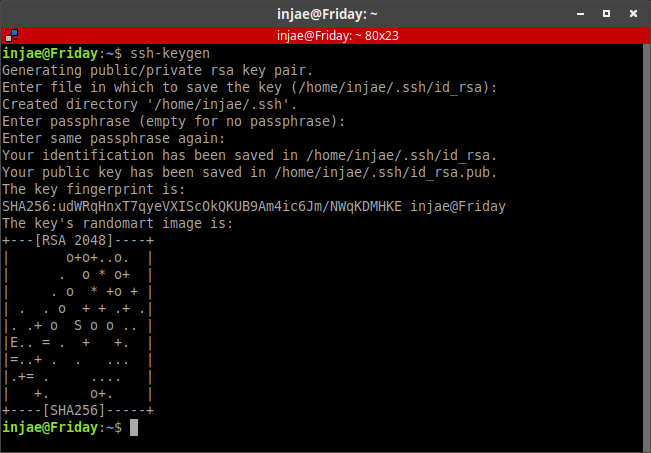
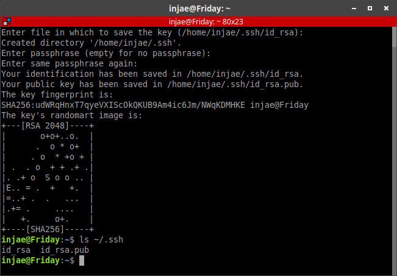

# Darknet_ros 설치
    작성일: 2020년 1월 3일
    작성자: 황인재
    최종 수정일 : 

## 0.JETSON 개발 환경 설정
    참고 : https://github.com/HY-HIGH/jetson_devel_env
    환경 : Jetpack 3.3.1 ,ubuntu 16.04 
    dependancy: CUDA , CUDNN , openCV

## 1.SSH key 


>ssh-keygen

  

    엔터 세 번


>ls ~/.ssh



> eval `ssh-agent`


>ssh-add ~/.ssh/id_rsa


> cat ~/.ssh/id_rsa.pub


- key를 볼수 있다 ,복사. 

        git hub로 이동

## 2. Clone

> cd catkin_ws/src

> git clone --recursive git@github.com:leggedrobotics/darknet_ros.git


>cd ..


## 3.Make

>catkin_make -DCMAKE_BUILD_TYPE=Release

    오류발생시 : https://github.com/leggedrobotics/darknet_ros
    원문 참고 및 이슈 리스트 참고 
    동일 개발 환경 상에서 오류 이슈 없었음.(18.04의 경우 오류 발생)

* 오류 예시 (원문) 

        nvcc fatal : Unsupported gpu architecture 'compute_61'.

        -O3 -gencode arch=compute_62,code=sm_62

## 4.Download Weights

>cd catkin_ws/src/darknet_ros/darknet_ros/yolo_network_config/weights/
* COCO data set
    >wget http://pjreddie.com/media/files/yolov2.weights

    >wget http://pjreddie.com/media/files/yolov2-tiny.weights

* VOC data set
    >wget http://pjreddie.com/media/files/yolov2-voc.weights

    >wget http://pjreddie.com/media/files/yolov2-tiny-voc.weights

* YOLO v3 data set
    >wget http://pjreddie.com/media/files/yolov3-voc.weights

    >wget http://pjreddie.com/media/files/yolov3.weights

* 직접 만든 데이타 셋 사용시 원문 참고  

        https://github.com/leggedrobotics/darknet_ros


--- 
## 5. usb_cam Download 및 성능 향상(fps)
### 1) usb_cam Download

>cd catkin_ws/src 

>git clone https://github.com/bosch-ros-pkg/usb_cam.git

>cm  

    (make)
  

>ls -ltr /dev/video*   

    usb캠이 정상적으로 연결 되어 있는지 확인

  

    dev/video0 은 노트북 기본 웹캠이고, 그 외 video1이 usb 카메라가 된다.

* node 파일의 video0 을 video1 로 변경해 준다. (아래 코드 참조)
  
### 2) fps 향상
* 카메라를 로봇에서 사용할때 도움되지 않는 것들.
  
  AUTO FOCUS와 WHITE BALANCE  

    따라서 노드 파일에서 이것을 수정해 준다.
``` c++
UsbCamNode() :
      node_("~")
  {
    // advertise the main image topic
    image_transport::ImageTransport it(node_);
    image_pub_ = it.advertiseCamera("image_raw", 1);

    // grab the parameters
    node_.param("video_device", video_device_name_, std::string("/dev/video1"));
    //Video 1로 변경
    node_.param("brightness", brightness_, -1); //0-255, -1 "leave alone"
    node_.param("contrast", contrast_, -1); //0-255, -1 "leave alone"
    node_.param("saturation", saturation_, -1); //0-255, -1 "leave alone"
    node_.param("sharpness", sharpness_, -1); //0-255, -1 "leave alone"
    // possible values: mmap, read, userptr
    node_.param("io_method", io_method_name_, std::string("mmap"));
    node_.param("image_width", image_width_, 640); //이미지 사이즈 조절
    node_.param("image_height", image_height_, 480);
    node_.param("framerate", framerate_, 30);
    // possible values: yuyv, uyvy, mjpeg, yuvmono10, rgb24
    node_.param("pixel_format", pixel_format_name_, std::string("mjpeg"));
    // enable/disable autofocus
    node_.param("autofocus", autofocus_, false); //오토 포커스 false
    node_.param("focus", focus_, -1); //0-255, -1 "leave alone"
    // enable/disable autoexposure
    node_.param("autoexposure", autoexposure_, false);//오토 노출 false
    node_.param("exposure", exposure_, 100);
    node_.param("gain", gain_, -1); //0-100?, -1 "leave alone"
    // enable/disable auto white balance temperature
    node_.param("auto_white_balance", auto_white_balance_, false);//오토 화이트 밸런스 false
    node_.param("white_balance", white_balance_, 4000);

    // load the camera info
    node_.param("camera_frame_id", img_.header.frame_id, std::string("head_camera"));
    node_.param("camera_name", camera_name_, std::string("head_camera"));
    node_.param("camera_info_url", camera_info_url_, std::string(""));
    cinfo_.reset(new camera_info_manager::CameraInfoManager(node_, camera_name_, camera_info_url_));

    // create Services
    service_start_ = node_.advertiseService("start_capture", &UsbCamNode::service_start_cap, this);
    service_stop_ = node_.advertiseService("stop_capture", &UsbCamNode::service_stop_cap, this);

```

* 알맞는 이미지 사이즈는(640*480) 다음을 통해 알 수 있다.
> v4l2-ctl --list-formats-ext

## 6. 구동 확인 
### 1) usb_cam_node 

* 1번 터미널
    >roscore
* 2번 터미널
    >rosrun usb_cam usb_cam_node
* 3번 터미널
    >rqt_image_view
  
    
 

      

### 2) YOLO
* 4번 터미널
    >roslaunch darknet_ros darknet_ros.launch  
    
      
      


 
   

## ISSUE LIST

### 18.04 open cv 설치 중
    libjasper-dev 설치 불가 문제 해결 방법

    https://ubuntu.pkgs.org/18.04/trinity-r14-builddeps-amd64/libjasper-dev_1.900.1-debian1-2.5ubuntu18.04.0+5_amd64.deb.html
